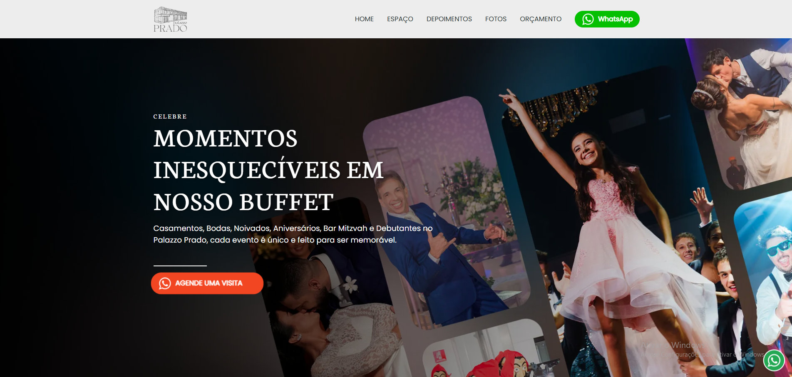

# 🏛️ Palazzo Prado

### Projeto front-end desenvolvido durante experiência profissional na Tecna

🔗 **Demonstração ao vivo:**  
https://thiago-tsg.github.io/Palazzo-Prado/

---

## 📸 Prévia



---

## ✨ Sobre o projeto

O **Palazzo Prado** é um projeto de front-end desenvolvido durante minha atuação na **Tecna**, com foco em estruturação de um fluxo moderno de desenvolvimento web utilizando automação de build.

O objetivo não era apenas criar uma interface, mas sim construir um ambiente de desenvolvimento escalável, organizado e otimizado para produção.

---

## 🎯 Objetivo

O projeto foi desenvolvido com foco em:

- estruturar um workflow moderno de front-end
- automatizar tarefas repetitivas com Gulp
- otimizar assets (CSS, JS e imagens)
- preparar o projeto para deploy em produção
- simular um fluxo real de desenvolvimento profissional

---

## 🧠 Abordagem

O projeto segue uma arquitetura baseada em pipeline de build, onde todo o código fonte passa por processos automatizados antes de chegar à versão final.

Isso garante:

- padronização de código
- otimização de performance
- redução de peso de assets
- organização de estrutura de arquivos

---

## ⚙️ Funcionalidades do build system (Gulp)

### 🧩 JavaScript
- Bundling com Browserify
- Transpilação com Babel
- Minificação com Uglify
- Estrutura modular via imports

### 🎨 CSS / SASS
- Compilação de SCSS
- Minificação automática
- Substituição de assets para WebP no CSS

### 🖼️ Imagens
- Conversão automática para WebP
- Otimização de PNG/JPG
- Suporte a SVG e ICO
- Organização de assets no build

### 🔤 Fonts
- Pipeline dedicado para fontes

### 🌐 HTML
- File Include para componentes reutilizáveis
- Substituição dinâmica de variáveis
- Otimização de paths para produção

### ⚡ Live Server
- BrowserSync integrado
- Reload automático
- Watch system para JS, SCSS, imagens e HTML

---

## 🧱 Arquitetura do projeto

O projeto segue uma separação clara entre desenvolvimento e produção:

- `src/` → código fonte (JS e SCSS)
- `assets/` → imagens, fontes e recursos estáticos
- `dist/` → build final otimizado
- `gulpfile.js` → pipeline de automação

---

## 🚀 Fluxo de desenvolvimento

1. Desenvolvimento em `src/`
2. Processamento via Gulp
3. Geração de build otimizado em `dist/`
4. Servidor local com live reload
5. Deploy da versão final

---

## 🛠️ Stack tecnológica

- HTML5
- SCSS
- JavaScript (ES6+)
- Gulp.js
- Browserify
- Babel
- BrowserSync
- Uglify / Terser
- Imagemin + WebP
- Node.js

---

## 🚀 Como executar o projeto

```bash
git clone https://github.com/thiago-tsg/Palazzo-Prado.git
cd Palazzo-Prado
npm install